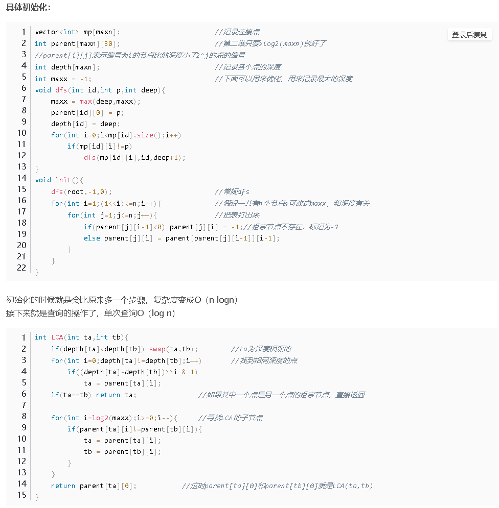

# 图论

### 点分治

```cpp
//点分治
#include <bits/stdc++.h>

using namespace std;
typedef long long ll;
const int maxn = 20005;
const int inf = 0x3f3f3f3f;
const int mod = 1e9 + 7;

struct edge {
    int to, val;
};
vector<edge> mp[maxn];

int mini, rt, totSZ;
int sz[maxn], dis[maxn];
bool vis[maxn];

int l, r, q[maxn];  //q为每次得到的距离合集

int n, ans; //ans记录合法点对

void getRT(int u, int pre) {    //每次调用 getRT() 前使 mini=inf, totSZ = sz[v];
    sz[u] = 1;
    int mxSub = 0;
    for (auto it: mp[u]) {
        int v = it.to;
        if (v == pre || vis[v]) continue;
        getRT(v, u);
        sz[u] += sz[v];
        mxSub = max(mxSub, sz[v]);
    }
    int mx = max(mxSub, totSZ - sz[u]);
    if (mx < mini) {
        mini = mx;
        rt = u;
    }
}

void getDIS(int u, int pre) {
    q[++r] = dis[u];
    for (auto it: mp[u]) {
        int v = it.to, val = it.val;
        if (v == pre || vis[v]) continue;
        dis[v] = dis[u] + val;
        getDIS(v, u);
    }
}

int calc(int u, int val) {
    l = 1, r = 0;
    dis[u] = val;
    getDIS(u, 0);
    //按照题意处理q
    return sum;
}

void dfs(int u) {
    vis[u] = true;
    ans += calc(u, 0);
    for (auto it: mp[u]) {
        int v = it.to, val = it.val;
        if (vis[v]) continue;
        ans -= calc(v, val);
        mini = inf;
        totSZ = sz[v];
        getRT(v, 0);
        dfs(rt);
    }
}

int main() {
    while (~scanf("%d", &n)) {
        for (int i = 1; i <= n; i++) {
            mp[i].clear();
            vis[i] = false;
        }
        ans = 0;
        for (int i = 1; i < n; i++) {
            int u, v, val;
            scanf("%d%d%d", &u, &v, &val);
            mp[u].push_back(edge{v, val});
            mp[v].push_back(edge{u, val});
        }

        mini = inf;
        totSZ = n;
        getRT(1, 0);
        dfs(rt);
        printf("%d\n", ans);
    }
    return 0;
}

```


### 轻重链剖分

```cpp
// Problem: P3384 【模板】轻重链剖分
// Contest: Luogu
// URL: https://www.luogu.com.cn/problem/P3384
// Memory Limit: 125 MB
// Time Limit: 1000 ms
// 已知一棵包含 N 个结点的树（连通且无环），每个节点上包含一个数值，需要支持以下操作：
// 操作 1： 格式： 1 x y z 表示将树从 x 到 y 结点最短路径上所有节点的值都加上 z
// 操作 2： 格式： 2 x y 表示求树从 x 到 y 结点最短路径上所有节点的值之和
// 操作 3： 格式： 3 x z 表示将以 x 为根节点的子树内所有节点值都加上 z
// 操作 4： 格式： 4 x 表示求以 x 为根节点的子树内所有节点值之和
// Powered by CP Editor (https://cpeditor.org)

#include <bits/stdc++.h>

using namespace std;
typedef long long ll;
const int N = 1e5 + 10;

int n, q, rt;
int dp[N], fa[N], son[N], ord[N], dep[N], a[N], top[N];
ll val[N], mod;
vector<int> G[N];

ll T[N << 2];
ll lazy[N << 2];

void push_down(int l, int r, int id) {
    if (lazy[id] == 0) return;
    int m = (l + r) >> 1;
    T[id << 1] += (m - l + 1) * lazy[id] % mod;
    T[id << 1] %= mod;
    T[id << 1 | 1] += (r - m) * lazy[id] % mod;
    T[id << 1 | 1] %= mod;
    lazy[id << 1] += lazy[id];
    lazy[id << 1] %= mod;
    lazy[id << 1 | 1] += lazy[id];
    lazy[id << 1 | 1] %= mod;
    lazy[id] = 0;
}

void push_up(int id) {
    T[id] = T[id << 1] + T[id << 1 | 1];
    T[id] %= mod;
}

void update(int ql, int qr, int l, int r, ll k, int id) {
    if (ql <= l && r <= qr) {
        lazy[id] += k;
        lazy[id] %= mod;
        T[id] += (r - l + 1) * k % mod;
        T[id] %= mod;
        return;
    }
    push_down(l, r, id);
    int m = (l + r) >> 1;
    if (ql <= m) update(ql, qr, l, m, k, id << 1);
    if (qr > m) update(ql, qr, m + 1, r, k, id << 1 | 1);
    push_up(id);
}

ll query(int ql, int qr, int l, int r, int id) {
    if (ql <= l && r <= qr) {
        return T[id] % mod;
    }
    push_down(l, r, id);
    ll ret = 0;
    int m = (l + r) >> 1;
    if (ql <= m) ret += query(ql, qr, l, m, id << 1) % mod, ret %= mod;
    if (qr > m) ret += query(ql, qr, m + 1, r, id << 1 | 1) % mod, ret %= mod;
    return ret;
}

void build(int l, int r, int id) {
    if (l == r) {
        T[id] = val[l] % mod;
        return;
    }
    int m = (l + r) >> 1;
    build(l, m, id << 1);
    build(m + 1, r, id << 1 | 1);
    push_up(id);
}

void init(int now, int father, int depth) {
    fa[now] = father;
    dp[now] = 1;
    dep[now] = depth;
    int mx = 0;
    for (int i : G[now]) {
        if (i == father) continue;
        init(i, now, depth + 1);
        dp[now] += dp[i];
        mx = max(mx, dp[i]);
    }
    for (int i : G[now]) {
        if (i == father) continue;
        if (dp[i] == mx) {
            son[now] = i;
            break;
        }
    }
}

int cnt;

void dfs(int now, int father, int st) {
    top[now] = st;
    ord[now] = ++cnt;
    val[ord[now]] = a[now];
    if (son[now]) dfs(son[now], now, st);
    for (int i : G[now]) {
        if (i == father) continue;
        if (i == son[now]) continue;
        dfs(i, now, i);
    }
}

int main() {
    ios_base::sync_with_stdio(false);
    cin >> n >> q >> rt >> mod;
    for (int i = 1; i <= n; ++i) cin >> a[i];
    for (int i = 1; i < n; ++i) {
        int u, v;
        cin >> u >> v;
        G[u].push_back(v);
        G[v].push_back(u);
    }
    init(rt, -1, 1);
    dfs(rt, -1, rt);
    build(1, n, 1);
    while (q--) {
        int op;
        cin >> op;
        if (op == 1) {
            int x, y, z;
            cin >> x >> y >> z;
            z %= mod;
            while (top[y] != top[x]) {
                if (dep[top[x]] > dep[top[y]]) swap(x, y);
                update(ord[top[y]], ord[y], 1, n, z, 1);
                y = fa[top[y]];
            }
            if (dep[x] > dep[y]) swap(x, y);
            update(ord[x], ord[y], 1, n, z, 1);
        } else if (op == 2) {
            int x, y;
            cin >> x >> y;
            ll ans = 0;
            while (top[y] != top[x]) {
                if (dep[top[x]] > dep[top[y]]) swap(x, y);
                ans += query(ord[top[y]], ord[y], 1, n, 1) % mod;
                ans %= mod;
                y = fa[top[y]];
            }
            if (dep[x] > dep[y]) swap(x, y);
            ans += query(ord[x], ord[y], 1, n, 1);
            ans %= mod;
            cout << ans << '\n';
        } else if (op == 3) {
            int x, z;
            cin >> x >> z;
            z %= mod;
            update(ord[x], ord[x] + dp[x] - 1, 1, n, z, 1);
        } else {
            int x;
            cin >> x;
            ll ans = query(ord[x], ord[x] + dp[x] - 1, 1, n, 1) % mod;
            cout << ans << '\n';
        }
    }
    return 0;
}
```


### 虚树

```cpp
// Problem: P2495 [SDOI2011]消耗战
// 1为根，每次可以炸毁一个边，花费为边权。
// m次询问，每次要求让k个关键点无法到达1，问最小花费
// 对于每次询问单独建树，dfs序+单调栈优化

#include <bits/stdc++.h>

using namespace std;
typedef long long ll;
const int N = 3e5 + 10;
vector<pair<int, ll>> G[N];
vector<int> g[N];
int ord[N]; //dfs序
int stk[N];
int dep[N];
int parent[N][30];
bool inq[N]; //是否为关键点
ll minV[N]; //从1到i不联通的最小花费
ll dp[N]; //ans
int now;
int maxx = 0;

void dfs1(int u, int fa) {
    ++now;
    ord[u] = now;
    dep[u] = dep[fa] + 1;
    maxx = max(maxx, dep[u]);
    parent[u][0] = fa;
    for (auto pii : G[u]) {
        int v = pii.first;
        ll w = pii.second;
        if (v == fa) continue;
        minV[v] = min(minV[u], w);
        dfs1(v, u);
    }
}

void dfs2(int u) {
    ll sum = 0;
    for (int v : g[u]) {
        dfs2(v);
        sum += dp[v];
    }
    if (inq[u]) {
        dp[u] = minV[u];
    } else {
        dp[u] = min(minV[u], sum);
    }
    inq[u] = false;
    g[u].clear();
}

int n;

void init() {
    memset(minV, 0x3f, sizeof minV);
    dfs1(1, 0);
    for (int i = 1; (1 << i) <= n; ++i) {
        for (int j = 1; j <= n; ++j) {
            if (parent[j][i - 1] == 0) parent[j][i] = 0;
            else parent[j][i] = parent[parent[j][i - 1]][i - 1];
        }
    }
}

int LCA(int ta, int tb) {
    if (dep[ta] < dep[tb]) swap(ta, tb);
    for (int i = 0; dep[ta] != dep[tb]; ++i) {
        if ((dep[ta] - dep[tb]) >> i & 1)
            ta = parent[ta][i];
    }
    if (ta == tb) return ta;
    for (int i = log2(maxx); i >= 0; --i) {
        if (parent[ta][i] != parent[tb][i]) {
            ta = parent[ta][i];
            tb = parent[tb][i];
        }
    }
    return parent[ta][0];
}

void build() {
    vector<pair<int, int>> v;
    int k;
    cin >> k;
    for (int i = 0; i < k; ++i) {
        int id;
        cin >> id;
        inq[id] = true;
        v.emplace_back(ord[id], id);
    }
    sort(v.begin(), v.end());
    now = 0;
    stk[++now] = 1;
    g[1].clear();
    for (int i = 0; i < k; ++i) {
        int id = v[i].second;
        if (id != 1) {
            int lca = LCA(id, stk[now]);
            if (lca != stk[now]) {
                while (ord[lca] < ord[stk[now - 1]]) {
                    g[stk[now - 1]].push_back(stk[now]);
                    now--;
                }
                if (ord[lca] > ord[stk[now - 1]]) {
                    g[lca].clear();
                    g[lca].push_back(stk[now]);
                    now--;
                    stk[++now] = lca;
                } else {
                    g[lca].push_back(stk[now]);
                    now--;
                }
            }
        }
        g[id].clear();
        stk[++now] = id;
    }
    for (int i = 1; i < now; ++i) {
        g[stk[i]].push_back(stk[i + 1]);
    }
}

void solve() {
    cin >> n;
    for (int i = 1; i < n; ++i) {
        int u, v, w;
        cin >> u >> v >> w;
        G[u].emplace_back(v, w);
        G[v].emplace_back(u, w);
    }
    init();
    int m;
    cin >> m;
    while (m--) {
        build();
        dfs2(stk[1]);
        printf("%lld\n", dp[stk[1]]);
    }
}

int main() {
    ios_base::sync_with_stdio(false);
    int T = 1;
    // cin >> T;
    while (T--) {
        solve();
    }
    return 0;
}
```


### 网络流

感觉不如 awei template 。。。画质


### Tarjan

```cpp
const int N = 1e5 + 10;
vector<int> G[N];
int dfn[N], low[N];//dfn[u] -> u被搜索的次序 low[u] -> u子树中dfn最小值(包括自身)
int index;//搜索序号
stack<int> S;
bool ins[N];//是否进栈
int col[N], num_color;//染色

void Tarjan(int u) {
    dfn[u] = low[u] = ++index;
    S.push(u);//进栈
    ins[u] = true;
    for (int i: G[u]) {
        int v = i;
        if (!dfn[v]) { //未被访问过
            Tarjan(v);
            low[u] = min(low[u], low[v]); //找爸爸（环开头）最小的
        } else if (ins[v]) { //已被访问过且在栈内,则需要处理; 若不在栈内说明对应强连通分量处理完成
            low[u] = min(low[u], dfn[v]); //判断谁是爸爸
        }
    }
    if (dfn[u] == low[u]) { //发现更新完一轮自己是爸爸(某强连通分量中仅第一个被访问的结点满足dfn[u] == low[u])
        num_color++;
        int tmp;
        do {
            tmp = S.top();
            col[tmp] = num_color; //出栈，染色
            ins[tmp] = false;
            S.pop();
        } while (tmp != u);
        col[u] = num_color;
        ins[u] = false;
    }
}
```


### 倍增LCA




### dsu on tree

1. 先遍历轻儿子，并计算答案，但 **不保留遍历后它对答案的影响**；
2. 访问重儿子，**保留它对答案的影响**。
3. 再次遍历轻儿子，合并轻重儿子之间的答案。

```cpp
void dfs(int u, int fa, bool keep) {
    // 计算轻儿子的答案
    for (int v: G[u])
        if (v != fa && v != big[u]) {
            dfs(v, u, false);
        }
    // 计算重儿子答案并保留计算过程中的数据（用于继承）
    if (big[u]) {
        dfs(big[u], u, true);
    }
    for (int v: G[u])
        if (v != fa && v != big[u]) {
            // 子树结点的 DFS 序构成一段连续区间，可以直接遍历
            for (int i = L[v]; i <= R[v]; i++) {
                add(Node[i]);
            }
        }
    add(u);
    ans[u] = getAns();
    if (!keep) {
        for (int i = L[u]; i <= R[u]; i++) {
            del(Node[i]);
        }
    }
}
```

